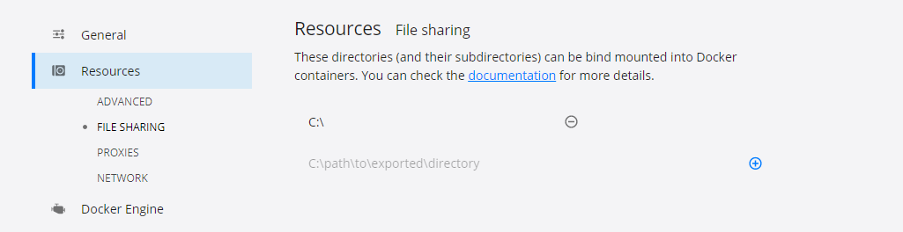
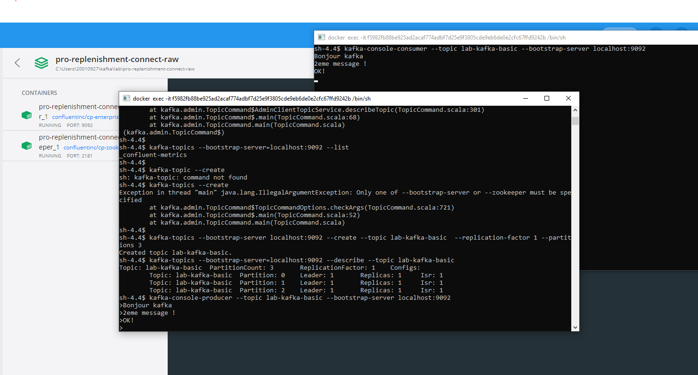
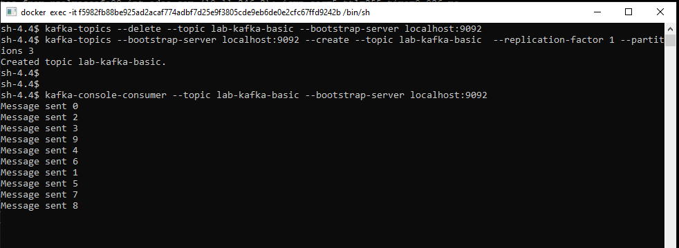
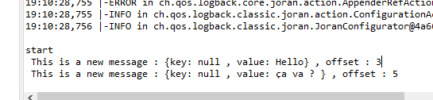

## Pré requis

- [ ] Installation docker-desktop pour windows
	- url https://docs.docker.com/docker-for-windows/install/
    - Mettre un dossier partagé pour le fileStreamSource (accessible depuis les container)
	
	- Récupération des images kafka   : ça prend du temps en ADSL !
```
docker pull confluentinc/cp-zookeeper:6.0.0
docker pull confluentinc/cp-enterprise-kafka:6.0.0
docker pull confluentinc/cp-schema-registry:6.0.0
docker pull confluentinc/cp-kafka-connect:6.0.0
```

- [ ] Installation de Conduktor  : https://www.conduktor.io/  
- [ ] Installation de Git Bash
- [ ] Installation de maven 
- [ ] Installation java 8 au moins

## Théorie

	
https://docs.google.com/presentation/d/1fo4PIAzzHIMt4Q_Nw0U21xplZEYt_B4DDWPWyXKpce8/edit#slide=id.gcc6d02f425_0_175
	
	Docs : 
	- https://kafka.apache.org/quickstart
	- https://docs.confluent.io/home/overview.html
	- https://github.com/adeo/adeo-data-streaming-platform


## Démarrage de Kafka en local

sur gitBash un dossier ~/kafka/lab, lancer  :
```
git clone git@github.com:glecoufle/lab-kafka-basic.git
cd lab-kafka-basic/
```

```
docker-compose -f docker-compose-kafka.yml up
```

## Topics

### Lister les topics

```
kafka-topics --bootstrap-server=localhost:9092 --list
```
### Créer un topic

```
kafka-topics --create --topic lab-kafka-basic --bootstrap-server localhost:9092
```
### Détails 
```
kafka-topics --bootstrap-server=localhost:9092 --describe --topic lab-kafka-basic
```

Topic: lab-kafka-basic  PartitionCount: 1       ReplicationFactor: 1    Configs:
        Topic: lab-kafka-basic  Partition: 0    Leader: 1       Replicas: 1     Isr: 1

### Delete 

```
kafka-topics --delete --topic lab-kafka-basic --bootstrap-server localhost:9092
```

```
kafka-topics --bootstrap-server localhost:9092 --create --topic lab-kafka-basic  --replication-factor 1 --partitions 3
```
sh-4.4$ kafka-topics --bootstrap-server=localhost:9092 --describe --topic lab-kafka-basic
Topic: lab-kafka-basic  PartitionCount: 3       ReplicationFactor: 1    Configs:
        Topic: lab-kafka-basic  Partition: 0    Leader: 1       Replicas: 1     Isr: 1
        Topic: lab-kafka-basic  Partition: 1    Leader: 1       Replicas: 1     Isr: 1
        Topic: lab-kafka-basic  Partition: 2    Leader: 1       Replicas: 1     Isr: 1

### Créer un producer

```
kafka-console-producer --topic lab-kafka-basic --bootstrap-server localhost:9092
```

### Créer un consumer

ouvrir un deuxième CLI
```
kafka-console-consumer --topic lab-kafka-basic --bootstrap-server localhost:9092

```
Reprocess des messages : from-beginning
```
kafka-console-consumer --topic lab-kafka-basic --bootstrap-server localhost:9092 --from-beginning
```



### Les logs  

se trouve ici :  /var/log/kafka

## Configuration Conducktor : 


### Local : 

- bootstrap server : localhost:9092
- zookeeper : localhost:2181
- kafka connect : http://localhost:8083
- schema registry : http://localhost:8081

### Dev : 

- bootstrap server : pkc-7yodp.europe-west1.gcp.confluent.cloud:9092
	- sasl.jaas.config=org.apache.kafka.common.security.plain.PlainLoginModule required username="CCZ27CDSN76GFSN7" password="XXXXXXXXXXXXX";
	- security.protocol=SASL_SSL
	- sasl.mechanism=PLAIN
- schema registry : https://schema-registry.adeo-dev-europe-west1.streaming.data.adeo.cloud
	- basic.auth.credentials.source=USER_INFO
	- schema.registry.basic.auth.user.info=XXXXXXXXXXXXX
- Compte de service :  svc-safe-app
- adeo-dev-europe-west1-INTERNAL-SAFE-BMES-ES-P1-C1-TEST-V1

### Staging :

- bootstrap server : pkc-l5mw2.europe-west1.gcp.confluent.cloud:9092
	- sasl.jaas.config=org.apache.kafka.common.security.plain.PlainLoginModule required username="7FZ2FQKLX2GAQE4K" password="XXXXXXXXXXXXX";
	- security.protocol=SASL_SSL
	- sasl.mechanism=PLAIN
- schema registry : https://schema-registry.adeo-staging-europe-west1.streaming.data.adeo.cloud
	- basic.auth.credentials.source=USER_INFO
	- schema.registry.basic.auth.user.info=XXXXXXXXXXXXX
- if you need to create schemas, you can use this endpoint: https://psrc-e0919.us-east-2.aws.confluent.cloud
- Compte de service :  svc-safe-app
- adeo-sit-europe-west1-INTERNAL-SAFE-BMES-ES-P1-C1-TEST-V1
- adeo-uat1-europe-west1-INTERNAL-SAFE-BMES-ES-P1-C1-TEST-V1

## PARTIE JAVA

### Classe producer    org.apache.kafka.clients.producer

https://docs.confluent.io/clients-kafka-java/current/overview.html
https://www.tutorialspoint.com/apache_kafka/apache_kafka_simple_producer_example.htm

ouvrir un consumer : 
```
kafka-console-consumer --topic lab-kafka-basic --bootstrap-server localhost:9092
```
But de l'exercice :   envoyer 10 messages au topic (une boucle allant de 0 à 9)


#### Configuration 

- java.util.Properties  avec 
    - props.put(ProducerConfig.BOOTSTRAP_SERVERS_CONFIG, BROKER_KAFKA);
    - props.put(ProducerConfig.ACKS_CONFIG, "all");
    - props.put(ProducerConfig.RETRIES_CONFIG, 0);
    - props.put(ProducerConfig.KEY_SERIALIZER_CLASS_CONFIG, "org.apache.kafka.common.serialization.StringSerializer");
    - props.put(ProducerConfig.VALUE_SERIALIZER_CLASS_CONFIG, "org.apache.kafka.common.serialization.StringSerializer");

#### Création de l'objet KafkaProducer

new KafkaProducer<String, String>(props);

#### Création du message  ProducerRecord  


Utilisation de la méthode Send de KafkaProducer


Fermer le producer producer.close();




### Classe consumer


But de l'exercice :   créer une classe java qui lit dans un  topic  120 fois toutes les 5 secondes et afficher la clef, la valeur et l'offset


#### Configuration (new Properties()) :

- ConsumerConfig.BOOTSTRAP_SERVERS_CONFIG
- ConsumerConfig.GROUP_ID_CONFIG
- ConsumerConfig.ENABLE_AUTO_COMMIT_CONFIG
- ConsumerConfig.AUTO_COMMIT_INTERVAL_MS_CONFIG
- ConsumerConfig.SESSION_TIMEOUT_MS_CONFIG
- ConsumerConfig.KEY_DESERIALIZER_CLASS_CONFIG, "org.apache.kafka.common.serialization.StringDeserializer" 
- ConsumerConfig.VALUE_DESERIALIZER_CLASS_CONFIG, "org.apache.kafka.common.serialization.StringDeserializer"

#### Utilisation de KafkaConsumer<String, String>
Méthode poll(Duration);

- Lancer la classe java
- Ouvrir un producer en ligne de commande et envoyer quelques messages 
- ...


## KAFKA CONNECT

### Configuration

https://docs.confluent.io/home/connect/configuring.html

### Kafka Connect FileStream Connectors

https://docs.confluent.io/home/connect/filestream_connector.html

### SFTP Source Connector for Confluent Platform

https://docs.confluent.io/5.5.0/connect/kafka-connect-sftp/source-connector/index.html

### Google Cloud Storage (GCS) Source

https://docs.confluent.io/kafka-connect-gcs-source/current/overview.html